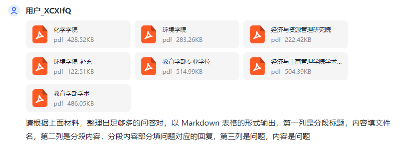
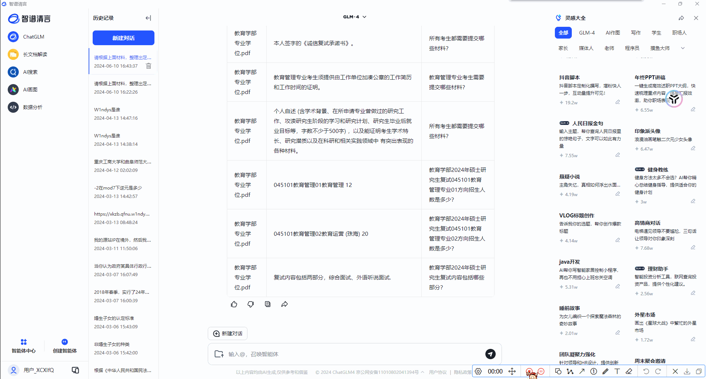
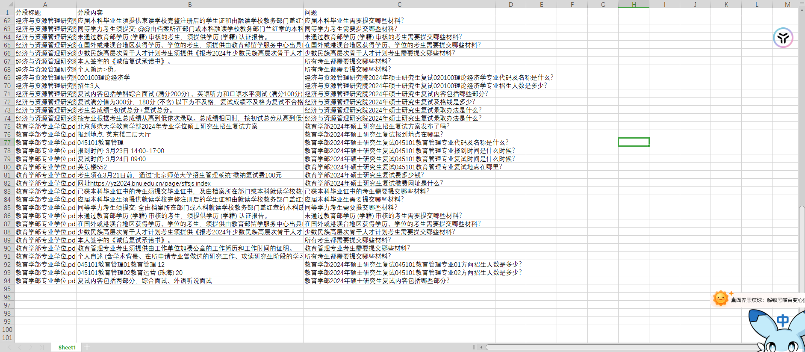

# Fast-QA-to-Excel

欢迎点个 star⭐

利用 Markdown+AI 提高**数据预处理**问答对的提取效率

>  声明 ：**官方师哥给出的方法已经很好，这里提供另外一种方法，切勿因此吹捧拉踩等**
> 本方法仅供参考，如有更好的方法，欢迎提交 Pull Request 或者 issues

## 背景

看到师哥的视频里的整理问答对的部分说 **鼓励同学通过编码实现**，我首先想到的是 Markdown 表格，然后用 Python 转成 Excel，后来发现可以直接让 AI 吐出 Markdown 表格，直接复制到 Excel 就可以

## 前置相关知识

1. Markdown 语法:

   Markdown 是一种轻量级标记语言，它允许人们使用易读易写的纯文本格式编写文档，然后转换成格式丰富的 HTML 页面。

   Markdown 编写的文档可以导出 HTML 、Word、图像、PDF、Epub 等多种格式的文档。

   Markdown 编写的文档后缀为 .md, .markdown。

2. 表格语法：

   Markdown 制作表格使用 | 来分隔不同的单元格，使用 - 来分隔表头和其他行。

3. Markdown 官方教程：https://markdown.com.cn/

## 提示词

下面是一个提示词例子，核心就是让 AI 提取出 **问答对** 对应的 **Markdown 表格**

> 请根据上面材料，整理出足够多的问答对，以 Markdown 表格的形式输出，第一列是分段标题，内容填文件名，第二列是分段内容，分段内容部分填问题对应的回复，第三列是问题，内容是问题

## 实机演示

由于 ChatGPT 无法识别 PDF，这里用智谱实测，虽然比较蠢

如果执意要使用 ChatGPT，可以用可以识别 PDF 的 AI 提取出纯文本问答对，再让 ChatGPT 转成 Markdown 表格

### 提示词

### 复制到 Excel

### 成果

## 致谢

1. [曲阜师范大学网络空间安全学院数字大脑团队](https://c605.cn/index)
2. 清华智谱 [ChatGLM](https://chatglm.cn/)
3. [W1ndys](https://github.com/W1ndys)
4. [Markdown 官方教程](https://markdown.com.cn/)

---

**本方法仅供参考，如有更好的方法，欢迎提交 Pull Request 或者 issues**
